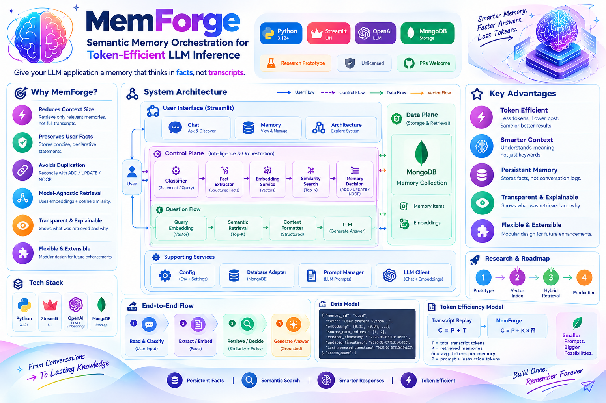
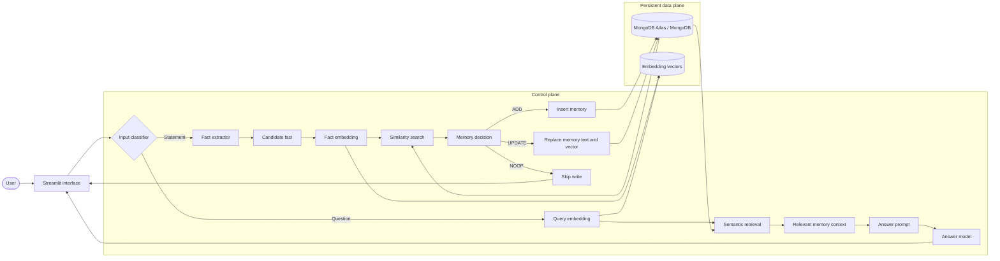
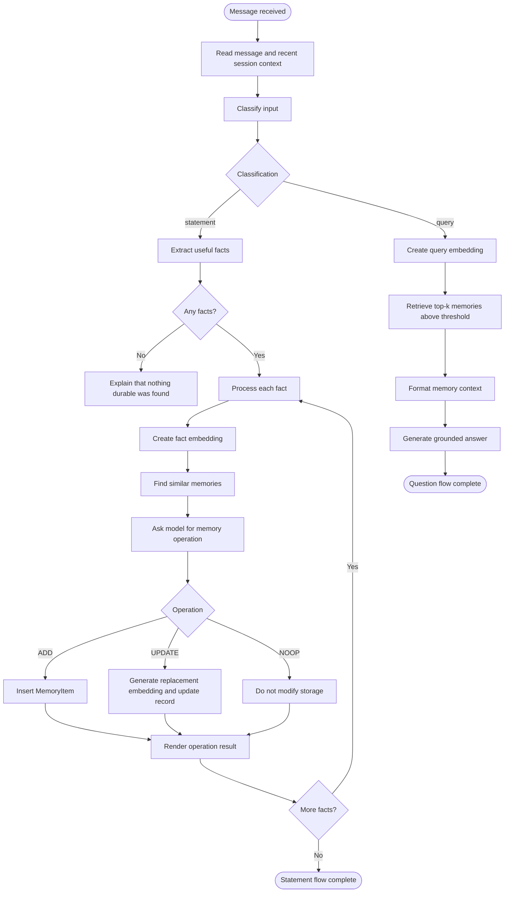
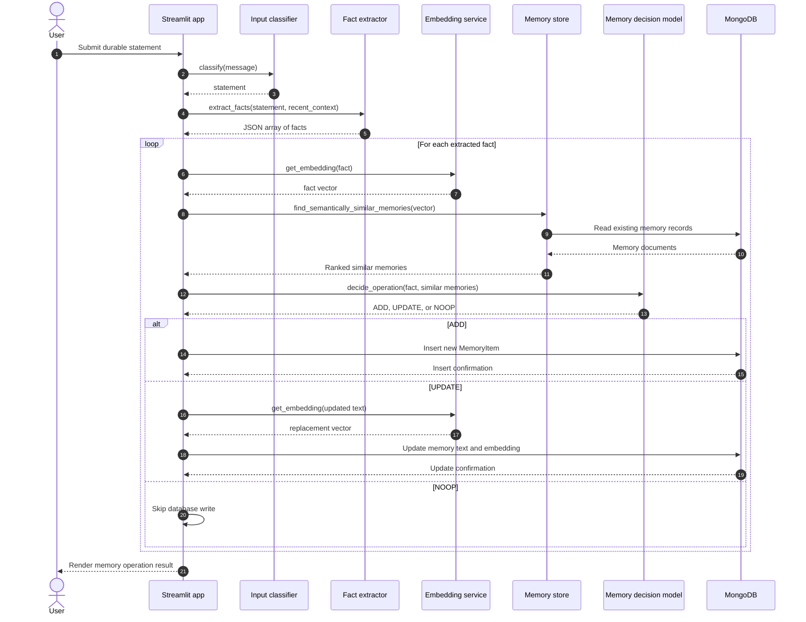
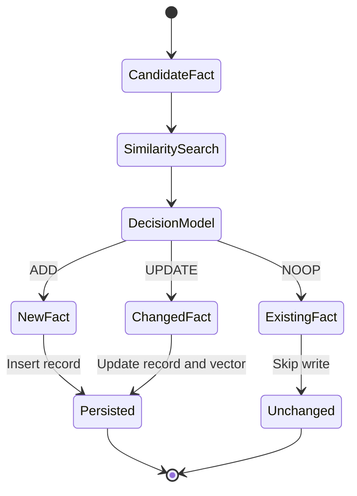
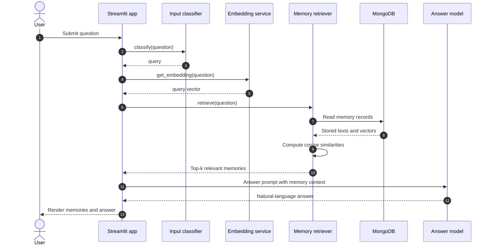
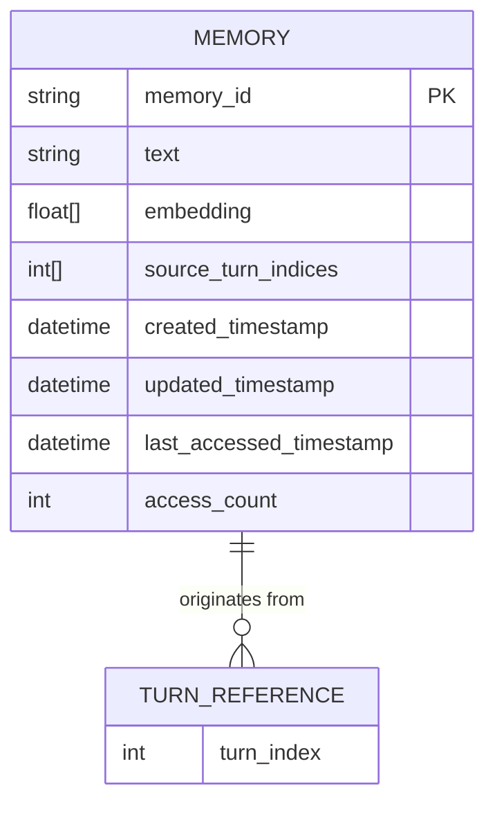
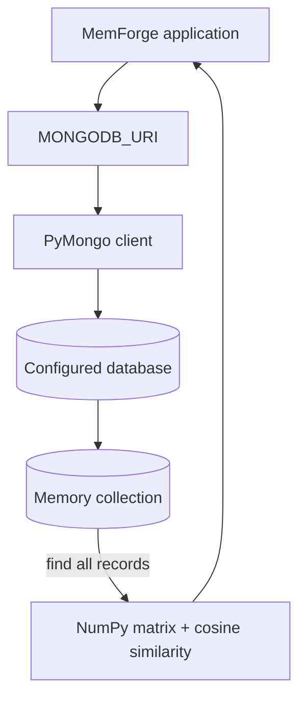
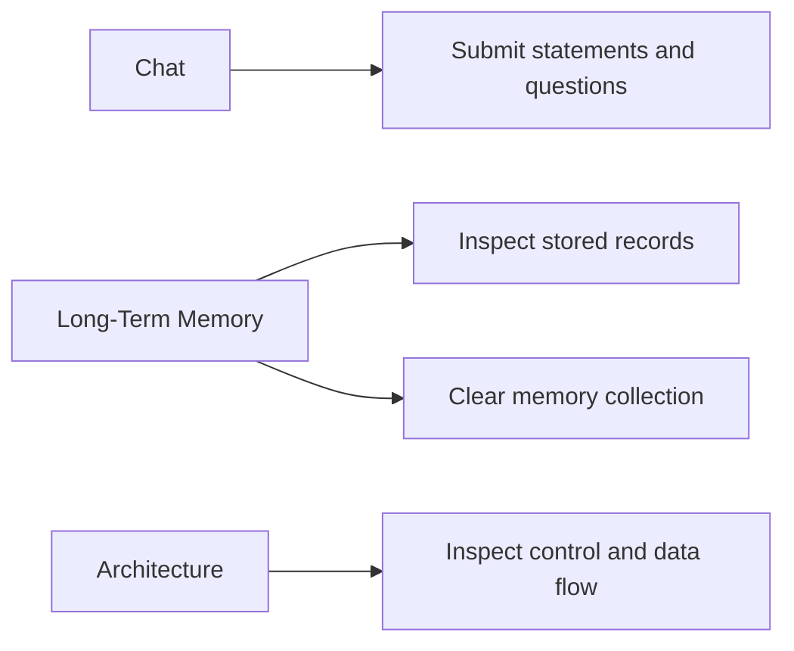
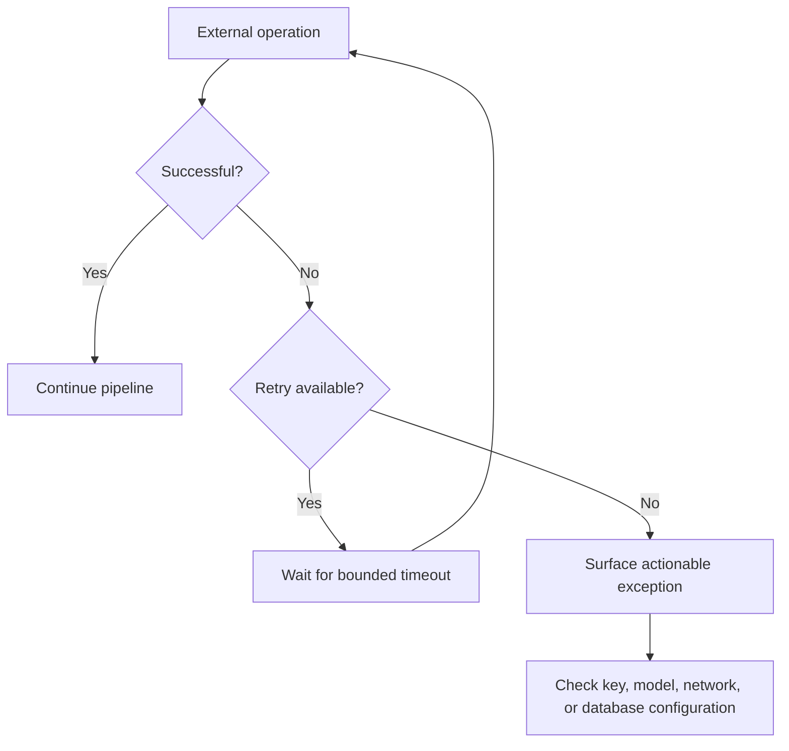

<div align="center">

# 🧠 MemForge

### Semantic Memory Orchestration for Token-Efficient LLM Inference

*Give your LLM application a memory that thinks in facts, not transcripts.*
### 🚀 [**Try the Live Demo →**](https://j7ash3upzdtg3seqggxmbe.streamlit.app/)

[](https://www.python.org/)
[](https://streamlit.io/)
[](https://platform.openai.com/docs)
[](https://www.mongodb.com/)


</div>


<br/>

> **MemForge is a semantic memory orchestration layer for LLM applications.**
> It transforms conversational statements into compact, persistent facts — and retrieves only the memories relevant to a later question, instead of replaying an entire transcript.

<br/>

---

## 📖 Table of Contents

<table>
<tr>
<td valign="top" width="33%">

**Understand**
- [Abstract](#-abstract)
- [Research Motivation](#-research-motivation)
- [Design Objectives](#design-objectives)

</td>
<td valign="top" width="33%">

**Architecture**
- [System Overview](#-system-overview)
- [Execution Model](#-end-to-end-execution-model)
- [Statement Memory Formation](#-statement-memory-formation)
- [Question Answering](#-question-answering--semantic-retrieval)
- [Data Model](#-data-model)

</td>
<td valign="top" width="33%">

**Operate**
- [Installation](#-installation--execution)
- [Configuration](#-configuration-reference)
- [MongoDB Deployment](#-mongodb-deployment)
- [Troubleshooting](#-troubleshooting)
- [Roadmap](#-extension-roadmap)

</td>
</tr>
</table>

---

## 💡 Abstract

Long-context prompting is a direct but inefficient strategy for preserving conversational history. It increases prompt size, introduces irrelevant context, and makes durable user facts difficult to manage.

**MemForge instead treats memory as a separate semantic data layer.**

For a user message $x$, the system first estimates whether $x$ is a statement or a question.

- 📝 For **statements**, it extracts a set of candidate facts $F = \{f_1, f_2, \ldots, f_n\}$. Each fact is encoded by an embedding function $E(\cdot)$, compared with stored vectors using cosine similarity, and passed to a reconciliation policy:

$$
\operatorname{decision}(f_i, M) \in \{\operatorname{ADD},\operatorname{UPDATE},\operatorname{NOOP}\}
$$

- ❓ For **questions**, the query embedding is compared against the memory index, and the top memories above a configurable similarity threshold are provided to the answer model.

This architecture cleanly separates **memory formation** from **memory use** — keeping the prompt sent to the answer model focused entirely on the current question.

---

## 🔍 Research Motivation

A conversational system needs more than a transcript buffer. A transcript records *what was said* — it does not determine *which information should remain useful* after the immediate interaction.

Durable memory requires at least four decisions, each made explicit in MemForge's architecture:

| # | Decision | Question it answers |
|:-:|----------|----------------------|
| 1️⃣ | **Relevance** | Is the message likely to matter in a future conversation? |
| 2️⃣ | **Representation** | Can the information be expressed as a concise fact? |
| 3️⃣ | **Consistency** | Does the fact conflict with or duplicate an existing memory? |
| 4️⃣ | **Retrieval** | Which memories are relevant to the current query? |

> Making each decision explicit — rather than delegating "remember everything" to a monolithic prompt — is what makes MemForge easier to **debug, extend, and evaluate**.

### Design Objectives

| 🎯 Objective | ⚙️ Design Response |
| --- | --- |
| Reduce repeated context | Retrieve a bounded set of relevant memory records instead of replaying the full conversation |
| Preserve user-controlled facts | Store concise declarative statements with source-turn metadata |
| Avoid uncontrolled duplication | Reconcile each candidate fact through `ADD`, `UPDATE`, or `NOOP` |
| Keep retrieval model-agnostic | Store vectors and compute cosine similarity in the memory layer |
| Make failures diagnosable | Separate services by responsibility and print update-stage progress |
| Keep the prototype understandable | Use synchronous Python modules with a small dependency surface |

---

## 🏗️ System Overview

The diagram below shows the complete control plane and data plane. The **control plane** decides *what a message means* and *how memory should change*. The **data plane** stores and retrieves the resulting semantic records.



### Component Responsibilities

| Component | Responsibility | Primary Module |
| --- | --- | --- |
| 🖥️ Streamlit application | Session state, user interaction, tabs, and orchestration | `app/streamlit_app.py` |
| 🎨 UI design system | Theme, cards, workflow view, architecture view, result rendering | `app/ui.py` |
| 🔀 Classifier | Predicts `statement` or `query` | `memory/classifier.py` |
| ⛏️ Fact extractor | Produces a JSON array of durable facts | `memory/extractor.py` |
| 📐 Embedding service | Converts text to numeric vectors | `llm/embeddings.py` |
| 🗄️ Memory store | Performs persistence and cosine-similarity search | `memory/store.py` |
| 🔁 Memory updater | Selects and applies `ADD`, `UPDATE`, or `NOOP` | `memory/updater.py` |
| 🔎 Retriever | Retrieves and formats relevant memories | `memory/retriever.py` |
| 🔌 Database adapter | Encapsulates MongoDB operations | `database/mongodb.py` |
| 🤖 LLM client | Encapsulates chat-completion calls | `llm/client.py` |

---

## 🔄 End-to-End Execution Model



---

## 📝 Statement Memory Formation

A statement is **never** written directly to MongoDB. It passes through an explicit semantic reconciliation pipeline.



### Fact Extraction Contract

The extractor is instructed to return **only** a JSON array of concise declarative strings:

```json
[
  "The user prefers Python for backend development.",
  "The user's target audience is early-stage developers."
]
```

> ℹ️ The parser accepts the first JSON array found in the model response and discards non-string items. An **empty array** means the statement does not contain a useful durable fact.

### Memory Reconciliation Policy



| Operation | Trigger | Storage Effect |
| :--: | --- | --- |
| 🟢 `ADD` | No existing memory adequately represents the fact | Insert a new record with text, embedding, identifier, and source turn |
| 🟡 `UPDATE` | The fact changes, replaces, or improves a similar memory | Update the target text and embedding, preserve the identifier, and merge turn indices |
| ⚪ `NOOP` | The fact is already represented or does not justify a change | No write is performed |

---

## ❓ Question Answering & Semantic Retrieval

Questions follow a different path — they never invoke the memory decision policy. The question itself becomes the retrieval representation.



For a query vector $q$ and a stored memory vector $m$, MemForge uses cosine similarity:

$$
\operatorname{sim}(q,m) = \frac{q \cdot m}{\lVert q \rVert \lVert m \rVert}
$$

A memory is eligible for the result set when:

$$
\operatorname{sim}(q,m) \geq \tau
$$

where $\tau$ is `MEMORY_SIMILARITY_THRESHOLD`. The result set is sorted in descending similarity order and truncated at `MEMORY_RETRIEVAL_TOP_K`.

---

## 🗂️ Data Model

Memories are represented by `MemoryItem` objects and serialized through the MongoDB adapter.



Conceptually, a stored record has the following shape:

```json
{
  "memory_id": "fa8884c0-b73f-40d0-a339-7604f3307793",
  "text": "The user prefers Python for backend development.",
  "embedding": [0.0123, -0.0441, 0.0872],
  "source_turn_indices": [1],
  "created_timestamp": "2026-09-07T10:14:08Z",
  "updated_timestamp": "2026-09-07T10:14:08Z",
  "last_accessed_timestamp": "2026-09-07T10:19:15Z",
  "access_count": 1
}
```

> 📏 The exact embedding array is much larger than the abbreviated example above. Its dimensionality must match `OPENAI_EMBEDDING_DIMENSIONS` and the selected embedding model configuration.

---

## ⚡ Token-Efficiency Model

Let:

| Symbol | Meaning |
| :--: | --- |
| $T$ | Number of tokens in the full historical transcript |
| $K$ | Number of retrieved memories |
| $\bar{m}$ | Average token length of one memory |
| $P$ | Fixed instruction and current-query token budget |

A **transcript-replay** approach sends approximately:

$$
C_{transcript} = P + T
$$

**MemForge** sends approximately:

$$
C_{memory} = P + K\bar{m}
$$

When $K\bar{m} \ll T$, the prompt supplied to the answer model is substantially smaller. The trade-off: memory formation introduces additional calls for classification, fact extraction, embedding, and reconciliation. In other words, **MemForge moves cost from repeated answer-time context transmission to an explicit memory-management pipeline.**

> ⚠️ This repository does not claim a benchmarked token reduction without a controlled evaluation. The equations describe the intended cost model; production measurements should be collected for the target workload.

---

## 📁 Repository Structure

```
MemForge/
├── app/
│   ├── streamlit_app.py       # Application orchestration and session state
│   └── ui.py                  # Light-theme design system and renderers
├── config/
│   └── settings.py            # Environment loading and typed settings
├── database/
│   └── mongodb.py             # MongoDB connection and CRUD adapter
├── llm/
│   ├── client.py              # OpenAI chat-completion wrapper
│   ├── embeddings.py          # OpenAI embedding wrapper
│   └── prompts.py             # Prompt contracts and prompt builders
├── memory/
│   ├── classifier.py          # Statement/query classifier
│   ├── extractor.py           # Structured fact extraction
│   ├── retriever.py           # Query retrieval and context formatting
│   ├── store.py               # Vector similarity and storage abstraction
│   └── updater.py             # Memory reconciliation orchestration
├── models/
│   └── memory.py              # MemoryItem domain model
├── .env.example                # Configuration template
├── .gitignore
├── main.py                     # Minimal package entry point
├── pyproject.toml               # Package metadata
├── requirements.txt             # Runtime dependencies
└── README.md
```

---

## 🧰 Runtime Requirements

| Requirement | Purpose |
| --- | --- |
| 🐍 Python 3.12+ | Runtime for the application |
| 🤖 OpenAI API access | Chat completions and embeddings |
| 🍃 MongoDB or MongoDB Atlas | Persistent memory storage |
| 🌐 Network access | Connectivity to the configured external services |

Runtime dependencies (`requirements.txt`):

```
openai
python-dotenv
pymongo
numpy
scikit-learn
streamlit
```

---

## 🚀 Installation & Execution

> 💡 **Want to try it first without installing anything?** Check out the [**live demo**](https://j7ash3upzdtg3seqggxmbe.streamlit.app/) hosted on Streamlit Cloud.

### 1️⃣ Clone the repository

```bash
git clone https://github.com/paras160500/MemForge-Semantic-Memory-Orchestration-for-Token-Efficient-LLM-Inference.git
cd MemForge-Semantic-Memory-Orchestration-for-Token-Efficient-LLM-Inference
```

### 2️⃣ Create an isolated environment

<table>
<tr><th>Windows PowerShell</th><th>macOS / Linux</th></tr>
<tr>
<td>

```powershell
python -m venv .venv
.\.venv\Scripts\Activate.ps1
```

</td>
<td>

```bash
python3 -m venv .venv
source .venv/bin/activate
```

</td>
</tr>
</table>

### 3️⃣ Install dependencies

```bash
python -m pip install --upgrade pip
pip install -r requirements.txt
```

### 4️⃣ Configure environment variables

<table>
<tr><th>Windows PowerShell</th><th>macOS / Linux</th></tr>
<tr>
<td>

```powershell
Copy-Item .env.example .env
```

</td>
<td>

```bash
cp .env.example .env
```

</td>
</tr>
</table>

Edit `.env` before launching the application.

### 5️⃣ Run Streamlit

```bash
streamlit run app/streamlit_app.py
```

🌐 The application is normally available at **`http://localhost:8501`**.

---

## ⚙️ Configuration Reference

```env
# OpenAI
OPENAI_API_KEY=your_openai_api_key
OPENAI_CHAT_MODEL=gpt-4o-mini
OPENAI_EMBEDDING_MODEL=text-embedding-3-small
OPENAI_EMBEDDING_DIMENSIONS=1536

# MongoDB
MONGODB_URI=mongodb://localhost:27017
MONGODB_DATABASE=memforge
MONGODB_MEMORY_COLLECTION=memories

# Retrieval and update policy
MEMORY_SIMILARITY_THRESHOLD=0.5
MEMORY_RETRIEVAL_TOP_K=3
SIMILAR_MEMORIES_FOR_UPDATE=3
```

| Variable | Type | Meaning | Typical Value |
| --- | :--: | --- | --- |
| `OPENAI_API_KEY` | string | API credential used by chat and embedding services | *Secret value* |
| `OPENAI_CHAT_MODEL` | string | Model used for classification, extraction, decisions, and answers | `gpt-4o-mini` |
| `OPENAI_EMBEDDING_MODEL` | string | Model used to create memory and query vectors | `text-embedding-3-small` |
| `OPENAI_EMBEDDING_DIMENSIONS` | integer | Embedding width used by the service and stored vectors | `1536` |
| `MONGODB_URI` | string | MongoDB connection string | *Local or Atlas URI* |
| `MONGODB_DATABASE` | string | Database containing the memory collection | `memforge` |
| `MONGODB_MEMORY_COLLECTION` | string | Collection storing memory documents | `memories` |
| `MEMORY_SIMILARITY_THRESHOLD` | float | Minimum cosine similarity accepted during retrieval | `0.5` |
| `MEMORY_RETRIEVAL_TOP_K` | integer | Maximum memories returned for a question | `3` |
| `SIMILAR_MEMORIES_FOR_UPDATE` | integer | Maximum similar records sent to the memory decision model | `3` |

> ✅ The similarity threshold and result limits are converted to numeric values during configuration loading. Invalid numeric values **fail fast at startup** rather than causing an ambiguous comparison error during retrieval.

---

## 🍃 MongoDB Deployment

MemForge supports a local MongoDB deployment and MongoDB Atlas. The adapter currently uses a **standard MongoDB collection** rather than a database-native vector-search index; vectors are loaded into Python and compared with scikit-learn cosine similarity.



For Atlas, create a database user and allowlist the IP address of the machine running the application. Set the resulting connection string in `MONGODB_URI`. The application calls a connection ping during initialization.

### Storage Considerations

The current similarity implementation performs a **linear scan** over eligible memory records. For a collection of $N$ records with embedding dimensionality $d$, the dominant comparison work is approximately:

$$
O(Nd) \text{ per search}
$$

*(excluding database transfer and matrix construction)*

This is appropriate for a compact prototype or research dataset. A larger deployment should consider a native vector index, an approximate-nearest-neighbor service, pagination, caching, and a clear migration strategy for embedding-model changes.

---

## 🖼️ UI Surfaces

The application exposes three primary views:



| View | Description |
| --- | --- |
| 💬 **Chat** | Displays the conversation with a single input surface. Statements show extracted facts and the resulting operation; questions show relevant memories and the generated answer. |
| 🗃️ **Long-Term Memory** | Displays memory statistics and each stored memory as a styled card. Provides a destructive clear-memory action that deletes all records in the configured collection. |
| 🏛️ **Architecture** | Presents the statement lane, question lane, reconciliation operations, persistent store, and technology layers as a visual pipeline. |

---

## 🔭 Observability & Failure Boundaries

Memory formation consists of several network and database boundaries. The updater prints explicit stages to the terminal:

```
[1/4] Creating embedding...
[2/4] Searching similar memories...
[3/4] Asking ChatGPT whether to ADD / UPDATE / NOOP...
[4/4] Applying the decision...
```

The OpenAI wrappers use bounded request timeouts and retries to prevent an unreachable API from leaving the Streamlit interface in an apparently endless loading state. MongoDB connectivity is checked during service initialization, while subsequent database errors are surfaced by Streamlit.



---

## 🛠️ Troubleshooting

<details>
<summary><b>The interface remains on "Updating memory…"</b></summary>
<br/>

A statement can invoke classification, extraction, fact embedding, semantic search, and a memory decision request. Run Streamlit from a terminal and inspect the last printed updater stage. Confirm the API key, model names, network access, and MongoDB connection string. The bounded OpenAI timeout should eventually expose the underlying exception.
</details>

<details>
<summary><b><code>TypeError: '&lt;' not supported between instances of 'float' and 'str'</code></b></summary>
<br/>

This occurs when `MEMORY_SIMILARITY_THRESHOLD` is passed to semantic search as a string. Use the latest `config/settings.py`, which parses the threshold with `float()`, and restart Streamlit after changing Python files.
</details>

<details>
<summary><b>MongoDB connection errors</b></summary>
<br/>

Confirm that `MONGODB_URI` is correct, the configured database and collection are available, and the Atlas IP allowlist includes the current machine. Verify that the database user has read and write access.
</details>

<details>
<summary><b>Raw HTML is displayed instead of a styled card</b></summary>
<br/>

Use the latest `app/ui.py`. The current renderer uses `st.html()` when the installed Streamlit version supports it and falls back to HTML-enabled Markdown for older versions. Upgrade Streamlit if necessary:

```bash
pip install --upgrade streamlit
```
</details>

<details>
<summary><b>No memories are retrieved</b></summary>
<br/>

Lower `MEMORY_SIMILARITY_THRESHOLD` for experimentation, confirm that stored vectors were generated with the same embedding configuration as query vectors, and verify that the collection contains records with non-empty embeddings.
</details>

<details>
<summary><b>The model returns malformed JSON</b></summary>
<br/>

The classifier, fact extractor, and memory updater each include lightweight response parsers. Confirm that the configured chat model is available and that the prompts are not being modified by an incompatible proxy or wrapper.
</details>

---

## 🧪 Experimental Evaluation Plan

MemForge is a reference implementation, **not** a completed benchmark study. A rigorous evaluation should measure both memory quality and inference efficiency.

| Evaluation Dimension | Suggested Metric | Experimental Comparison |
| --- | --- | --- |
| 🎯 Fact extraction | Precision, recall, and F1 over human-labeled durable facts | MemForge extractor vs. transcript heuristics |
| 🔎 Retrieval quality | Recall@k, MRR, and nDCG | Semantic retrieval vs. lexical retrieval |
| 🧩 Memory consistency | Duplicate rate and contradiction rate | Reconciliation enabled vs. append-only storage |
| ⚓ Answer grounding | Human or model-judged factual support | Retrieved-context answers vs. no-memory answers |
| ⚡ Efficiency | Prompt tokens, latency, and API calls | Full transcript replay vs. bounded memory context |
| 🗃️ Storage behavior | Records per session and update frequency | `ADD`-only policy vs. `ADD/UPDATE/NOOP` policy |

A representative evaluation corpus should contain multi-turn conversations with explicit preferences, changed preferences, irrelevant statements, paraphrases, and questions that require one or more earlier facts. Each conversation should have a gold memory set and an expected answer-support set.

---

## 🗺️ Extension Roadmap

| Extension | Relevant Boundary | Expected Benefit |
| --- | --- | --- |
| 🔍 Native vector search | `MemoryStore` and `database/mongodb.py` | Better scaling than a Python linear scan |
| 🧬 Hybrid retrieval | `MemoryRetriever` | Combine semantic and lexical signals |
| 📊 Memory confidence | `MemoryItem` and updater policy | Filter uncertain or low-value facts |
| ✅ User approval workflow | Streamlit statement path | Give users control over sensitive memories |
| ⏳ Memory expiration | Data model and store | Retire stale preferences and temporary plans |
| 🔄 Embedding migrations | Storage adapter | Re-encode records when models change |
| 📐 Evaluation harness | New test and benchmark package | Quantify retrieval, consistency, and token savings |
| ⚡ Async execution | LLM and database service boundaries | Improve responsiveness under concurrent usage |

---

## 🔐 Security & Privacy

The application stores user-derived facts persistently.

- 🚫 Do **not** commit `.env` or expose `OPENAI_API_KEY` in source control.
- 🔑 Use a least-privilege MongoDB user, restrict network access, and secure the database deployment.
- 🗑️ Memory deletion is intentionally explicit in the Long-Term Memory view. The clear-memory action deletes **all** records in the configured collection and should be treated as **irreversible** unless a database backup exists.

> Before deploying MemForge with real user data, define retention, deletion, access-control, audit, and data-processing policies appropriate to the application context.

---

## 🧑‍💻 Development Workflow

Run syntax validation before committing changes:

```bash
python -m compileall -q app config database llm memory models
```

Run the application locally:

```bash
streamlit run app/streamlit_app.py
```

> When changing prompts, validate both the expected model response format and the parser fallback behavior. When changing embedding models or dimensions, plan a migration for existing records — vectors from incompatible configurations should never be compared directly.

---

## 📄 License

No license file is currently included in the repository. **Add an explicit license** before distributing MemForge as an open-source project or incorporating it into a commercial product.

---

## 📚 References

| | |
|---|---|
| [1] | [OpenAI Platform Documentation](https://platform.openai.com/docs) |
| [2] | [MongoDB Documentation](https://www.mongodb.com/docs/) |
| [3] | [Streamlit Documentation](https://docs.streamlit.io/) |
| [4] | [scikit-learn Cosine Similarity Documentation](https://scikit-learn.org/stable/modules/generated/sklearn.metrics.pairwise.cosine_similarity.html) |
| [5] | [MongoDB Atlas Vector Search Documentation](https://www.mongodb.com/docs/atlas/atlas-vector-search/vector-search-overview/) |
| [6] | [MemForge Repository](https://github.com/paras160500/MemForge-Semantic-Memory-Orchestration-for-Token-Efficient-LLM-Inference) |

<br/>

<div align="center">

**Built for developers who want their LLM apps to remember — precisely, efficiently, and transparently.**

⭐ *If MemForge's architecture is useful to you, consider starring the repository.*

</div>